# 🏛️ PROYECTO FORTALEZA JMRD: ARQUITECTURA OPTIMIZADA

**Filosofía:** "Headless First" (Sin monitores). Todo se gestiona por SSH/PowerShell Remoto.

## 1. 🗺️ La Topología de Red (Gestión "Fuera de Banda")

Para usar Solar-Putty con Windows, necesitamos una red dedicada de gestión que no pase por el Firewall (Sophos), para que nunca pierdas acceso si configuras mal una regla de bloqueo.

**Diseño Físico en GNS3:**

```mermaid
graph TD
    %% Nodos Principales
    Cloud((Nube NAT / Internet))
    SwMgmt[Switch GESTIÓN]
    Sophos[Firewall SOPHOS]
    SwLAN[Switch LAN Interno]
    
    %% Servidores y Clientes
    WinAD[Win Server Core AD]
    WinEx[Exchange Server]
    Win10[PC Cliente Win10]

    %% Estilos
    style Cloud fill:#f9f,stroke:#333,stroke-width:2px
    style SwMgmt fill:#ffcccc,stroke:#f00,stroke-width:2px
    style Sophos fill:#ff9900,stroke:#333,stroke-width:4px
    style SwLAN fill:#ccffcc,stroke:#0f0,stroke-width:2px

    %% CONEXIONES GESTIÓN (RED ROJA 192.168.x.x)
    Cloud ---|Internet + Tu PC| SwMgmt
    SwMgmt ---|Port A - WAN| Sophos
    SwMgmt -.->|NIC 1 - SSH/RDP| WinAD
    SwMgmt -.->|NIC 1 - Web Admin| WinEx

    %% CONEXIONES LAN PRODUCCIÓN (RED AZUL 10.10.10.x)
    Sophos ===|Port B - Gateway| SwLAN
    SwLAN ===|NIC 2 - Prod| WinAD
    SwLAN ===|NIC 2 - Prod| WinEx
    SwLAN ===|NIC Única| Win10

    %% Leyenda
    subgraph LEYENDA
    direction LR
    L1[--- Cable Gestión / WAN]
    L2[=== Cable LAN / Interno]
    end
```



1.  **Nube (NAT):** Fuente de Internet y Acceso a tu Host.
2.  **Switch de Gestión (Mgmt-SW):** Conectado a la Nube.
3.  **Sophos Firewall:**
      * **Port A (WAN):** Conectado a `Mgmt-SW`.
      * **Port B (LAN):** Conectado al `Switch-Interno`.
4.  **Switch Interno (LAN - 10.10.10.0/24):** Red segura/aislada.
5.  **Servidores (Doble Interfaz):**
      * **NIC 1 (Mgmt):** Conectada a `Mgmt-SW` (DHCP de la Nube). **IP para Solar-Putty.**
      * **NIC 2 (LAN):** Conectada a `Switch-Interno` (IP Fija). **Tráfico de producción.**

-----

## 2. 🛠️ Requisitos de "Alto Rendimiento" (Drivers)

Para que Windows en QEMU vuele y no se sienta lento, **ES OBLIGATORIO** usar los drivers **VirtIO**.

  * **Disco:** VirtIO SCSI (Lectura/Escritura nativa).
  * **Red:** VirtIO Net (10Gbps virtuales).
  * **Memoria:** Ballooning (Gestión eficiente).

**Descarga obligatoria:** `virtio-win.iso` (Drivers estables de Fedora).

-----

## 3. 🏗️ El Plan de Despliegue (Paso a Paso)

### FASE A: Controlador de Dominio (DC) - "El Cerebro Ligero"

Usaremos **Windows Server 2019 Standard CORE** (Sin GUI).

  * **Consumo:** ~700MB RAM.
  * **Objetivo:** Active Directory + DNS.
  * **Gestión:** 100% SSH/PowerShell.

**Configuración en GNS3:**

1.  Crear plantilla QEMU `WinServer-Core`.
2.  Montar ISO `Windows Server` + ISO `VirtIO`.
3.  Instalar cargando el driver `vioscsi` (Disco) y `netkvm` (Red) durante la instalación.

**⚡ El Truco SSH (PowerShell):**
Una vez instalado, verás solo una pantalla negra (`sconfig`). Ejecuta esto para activar SSH y gestionarlo con Solar-Putty:

```powershell
# 1. Entrar a PowerShell
PowerShell

# 2. Instalar OpenSSH Server (Requiere internet en NIC 1)
Add-WindowsCapability -Online -Name OpenSSH.Server~~~~0.0.1.0

# 3. Iniciar servicios y ponerlos automáticos
Start-Service sshd
Set-Service -Name sshd -StartupType 'Automatic'

# 4. Abrir el Firewall de Windows para el puerto 22
New-NetFirewallRule -Name sshd -DisplayName 'OpenSSH Server (sshd)' -Enabled True -Direction Inbound -Protocol TCP -Action Allow -LocalPort 22
```

*Resultado:* Cierras la consola VNC para siempre y usas Solar-Putty.

-----

### FASE B: Exchange Server - "El Gigante"

Exchange **requiere** mucha RAM. Aunque técnicamente *puede* correr en Core, para tu primera vez, recomiendo la versión **Desktop Experience (GUI)**, pero optimizaremos todo lo demás.

  * **Consumo:** Asignaremos **8 GB - 10 GB RAM**.
  * **Optimización:**
      * Desactivar Windows Defender (en lab es seguro y libera CPU).
      * Desactivar efectos visuales.
      * Instalar **OpenSSH** igual que en el Core para administrar la base por comandos.
  * **Gestión:** La configuración de Exchange se hace vía Web (ECP) desde tu navegador en Windows 11, accediendo por la IP de Gestión.

-----

### FASE C: Sophos XG - "El Muro"

  * **Formato:** Plantilla QEMU dedicada.
  * **Configuración:** SSH habilitado por defecto.
  * **Gestión:** Vía Web `https://<IP_Gestion>:4444` desde tu Windows 11.

-----

## 📝 GUÍA RÁPIDA DE COMANDOS (Tu "Cheat Sheet" para Solar-Putty)

Una vez tengas tus servidores conectados por SSH, usarás estos comandos en Solar-Putty para configurar todo a la velocidad de la luz (Copiar/Pegar).

### 1. Configurar Red (En Server Core DC)

*Pegar en Solar-Putty:*

```powershell
# Renombrar adaptadores (Identificar por MAC o estado)
Rename-NetAdapter -Name "Ethernet" -NewName "MGMT"
Rename-NetAdapter -Name "Ethernet 2" -NewName "LAN"

# Configurar IP LAN Fija
New-NetIPAddress -InterfaceAlias "LAN" -IPAddress 10.10.10.10 -PrefixLength 24 -DefaultGateway 10.10.10.1

# Establecer DNS (Google para salir, Localhost para AD)
Set-DnsClientServerAddress -InterfaceAlias "LAN" -ServerAddresses ("127.0.0.1", "8.8.8.8")
```

### 2. Instalar Active Directory (En Server Core DC)

*Pegar en Solar-Putty:*

```powershell
# Instalar Rol
Install-WindowsFeature AD-Domain-Services -IncludeManagementTools

# Promover a Controlador de Dominio
Install-ADDSForest -DomainName "JMRD.corp" -InstallDns:$true -Force:$true
```

### 3. Crear Usuarios Masivos (Script)

*Pegar en Solar-Putty:*

```powershell
# Crear Unidad Organizacional
New-ADOrganizationalUnit -Name "RecursosHumanos" -Path "DC=JMRD,DC=corp"

# Crear Usuarios Brenda y Wendy
New-ADUser -Name "Brenda" -GivenName Brenda -Surname RRHH -SamAccountName brenda -UserPrincipalName brenda@JMRD.corp -Path "OU=RecursosHumanos,DC=JMRD,DC=corp" -Enabled $true -PasswordNeverExpires $true -AccountPassword (ConvertTo-SecureString "JMRDpassword123!" -AsPlainText -Force)

New-ADUser -Name "Wendy" -GivenName Wendy -Surname RRHH -SamAccountName wendy -UserPrincipalName wendy@JMRD.corp -Path "OU=RecursosHumanos,DC=JMRD,DC=corp" -Enabled $true -PasswordNeverExpires $true -AccountPassword (ConvertTo-SecureString "JMRDpassword123!" -AsPlainText -Force)
```

-----

## 🚀 RESUMEN DEL FLUJO DE TRABAJO

1.  **Crear Plantillas QEMU:** Windows Server Core (con VirtIO) y Windows 10 LTSC.
2.  **Topología:** Montar el diseño de "Doble Switch" (Gestión + LAN).
3.  **Instalación Base:** Instalar Windows en los nodos.
4.  **Habilitar SSH:** Entrar una vez por VNC, activar OpenSSH y cerrar VNC para siempre.
5.  **Configuración Turbo:** Abrir Solar-Putty, conectar a las IPs de gestión y pegar los scripts de PowerShell para crear el Dominio y los Usuarios.
6.  **Exchange:** Instalarlo vía interfaz gráfica (RDP/VNC) pero gestionarlo vía Web.
