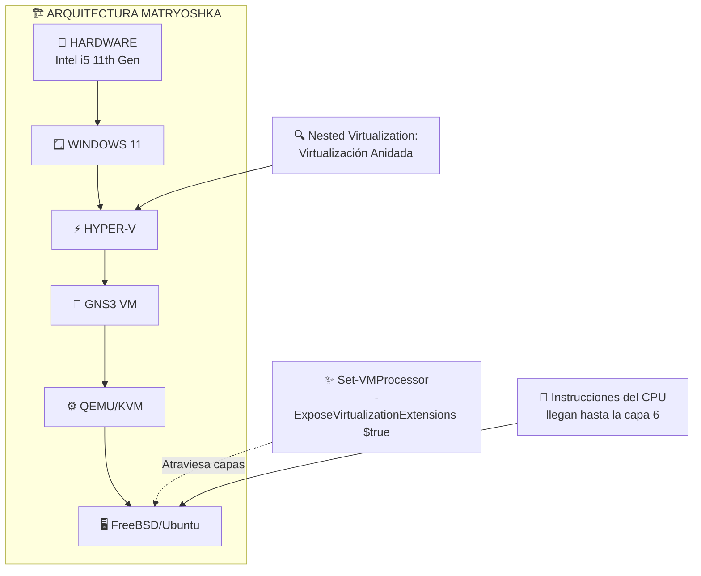

# 📘 BITÁCORA MAESTRA DE INGENIERÍA: PROYECTO JMRD.LAB

## 1. 🪆 La Arquitectura: "Matryoshka" (Muñeca Rusa Digital)

Descubriste que tu laboratorio no es una simple virtualización, sino una compleja torre de capas anidadas (Nested Virtualization). Entender esta arquitectura fue clave para diagnosticar y resolver problemas de compatibilidad.



**Desglose de Capas:**
1.  **🧱 Hardware:** Tu Laptop "Aquiles" (Intel i5 11th Gen, 24GB RAM)
2.  **🪟 Host OS:** Windows 11 Pro (sistema operativo base)
3.  **⚡ Hipervisor Nivel 1:** Hyper-V (gestiona recursos físicos reales)
4.  **🐧 VM Intermedia:** GNS3 VM (servidor Linux corriendo SOBRE Hyper-V)
5.  **⚙️ Emulador Nivel 2:** QEMU/KVM (viviendo DENTRO de GNS3 VM)
6.  **🖥️ Guest VM:** Tus servidores finales (FreeBSD / Ubuntu)

**🔑 El Logro Clave:** 
Para que la **capa 6** funcionara correctamente, tuviste que ejecutar en PowerShell:
```powershell
Set-VMProcessor -VMName "GNS3 VM" -ExposeVirtualizationExtensions $true
```
Este comando "perfora" las capas intermedias, permitiendo que las instrucciones de virtualización del CPU físico lleguen hasta el nivel más profundo.

---

## 2. ⚔️ El Conflicto: Hyper-V vs FreeBSD

Te enfrentaste a un verdadero "Jefe Final" de compatibilidad entre tecnologías.

* **🎯 El Síntoma Misterioso:**
  - `ping` → ✅ Funcionaba perfectamente (paquetes ICMP pequeños)
  - `pkg install` → ❌ Se congelaba al 0% (paquetes grandes/descargas TCP)

* **🔍 Diagnóstico:**
  Después de extensas pruebas, identificaste la causa raíz: una incompatibilidad entre los drivers de red de FreeBSD y la función **RSC (Receive Segment Coalescing)** de los switches virtuales de Hyper-V.

* **🔄 El Problema Técnico:**
  Hyper-V, en su afán por optimizar, unía múltiples paquetes pequeños en uno grande mediante RSC. FreeBSD recibía estos paquetes "coalesced" como datos corruptos y simplemente los descartaba silenciosamente.

---

## 3. 🌉 La Solución Ganadora: "El Puente Ubuntu"

Después de intentar parches de software (ajustar MTU, desactivar TSO), descubriste que la solución definitiva era **arquitectónica**, no configurativa.

**🌐 Topología de Rescate:**
```
FreeBSD → Ubuntu Gateway → NAT → Internet
```

* **🔧 Implementación Paso a Paso:**
  1.  **Configuración de Ubuntu:** Creaste una VM Ubuntu con dos interfaces de red:
      - `eth0`: Conexión a Internet (vía NAT de Hyper-V)
      - `eth1`: Red privada interna (172.16.10.0/24)

  2.  **Reconfiguración de FreeBSD:**
      - Cambiaste su gateway por defecto al Ubuntu (172.16.10.1)
      - Conectaste ambos sistemas a la misma red privada

  3.  **🔄 El Truco del Gateway:**
      Ubuntu, con drivers de red más modernos y compatibles con Hyper-V, recibía los paquetes "sucios" del exterior, los reensamblaba correctamente, y se los entregaba "limpios" a FreeBSD a través de la red interna.

* **✅ Resultado Final:**
  Descargas exitosas de paquetes, actualizaciones de sistema y funcionamiento completo de todos los servicios de red.

---

## 4. 📜 Infraestructura como Código (Scripting)

Con la conectividad resuelta, automatizaste la configuración para garantizar reproducibilidad y recuperación rápida.

**🛠️ Script Maestro: `install_full.sh`**

```bash
#!/bin/sh
# Script de instalación completa para servidor FreeBSD JMRD
# Incluye: Red + Paquetes + Servicios + Configuraciones
```

**📋 Capacidades Principales:**
- **🔧 Parches de Red:** Configura automáticamente `mtu 1200` para optimizar tráfico
- **📦 Gestión de Paquetes:** Instala con `-4` para forzar IPv4 y evitar problemas de resolución
- **⚙️ Configuración de Servicios:** 
  - Escribe `dhcpd.conf` completo para servicio DHCP
  - Configura `main.cf` de Postfix con dominio jmrd.com
  - Establece `dovecot.conf` con autenticación PAM
- **👥 Gestión de Usuarios:** Crea usuarios del sistema y alias de correo automáticamente

**🎯 Filosofía:** "Si el servidor muere, un script lo resucita en minutos, no en horas."

---

## 5. 🏢 Lógica de Negocio: El Departamento de RRHH

Transformaste un laboratorio técnico en una implementación funcional con reglas de negocio reales.

**📊 Stack de Servicios Implementado:**
- **📡 DHCP Server:** Asignación dinámica de IPs (rango: 172.16.10.100-200)
- **📧 Postfix:** Servidor SMTP con dominio `jmrd.com`
- **📭 Dovecot:** Servidor IMAP/POP3 con autenticación vía PAM

**🔐 Reto Superado - Autenticación:**
Descubriste que Dovecot necesitaba esta línea crítica en su configuración:
```nginx
passdb {
  driver = pam
}
```
Sin ella, Dovecot rechazaba todas las conexiones al no poder validar usuarios contra el sistema FreeBSD.

**👥 Implementación de RRHH:**
```bash
# Usuarios del sistema
useradd brenda
useradd wendy

# Alias corporativo
echo "nominas: brenda, wendy" >> /etc/aliases
```
- **📨 Flujo de Correo:** `nominas@jmrd.com` → se duplica → `brenda@jmrd.com` + `wendy@jmrd.com`
- **✅ Validación:** Comprobado con cliente externo (Lubuntu + Sylpheed) confirmando comunicación real entre máquinas

---

## 🏆 Conclusión: De Problemas Técnicos a Soluciones Arquitectónicas

Este proyecto demostró que a veces las soluciones más elegantes no son parches técnicos, sino **rediseños arquitectónicos**. La lección clave: cuando dos sistemas no se entienden, a veces necesitas un **intérprete** en el medio.

**📈 Habilidades Desarrolladas:**
1. Diagnóstico de problemas de red complejos
2. Nested virtualization y sus particularidades
3. Automatización de infraestructura
4. Implementación de servicios empresariales reales
5. Resolución creativa de incompatibilidades tecnológicas
