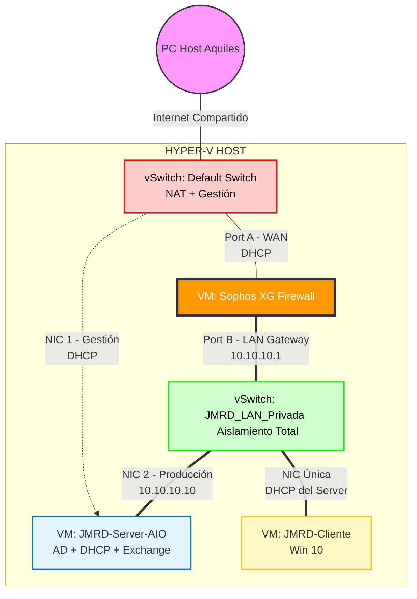

# 📘 GUÍA MAESTRA: PROYECTO FORTALEZA JMRD (Edición All-in-One)

**Objetivo:** Desplegar una infraestructura empresarial completa (AD, DNS, DHCP, Exchange, Firewall) optimizando recursos al unificar roles en un servidor potente.
**Plataforma:** Hyper-V Nativo en Windows 11.

-----

## 🗺️ 1. ARQUITECTURA DE RED

En lugar de cables físicos, utilizaremos **Conmutadores Virtuales (vSwitches)** de Hyper-V para crear zonas de seguridad.

### 📋 Resumen de Direccionamiento IP

| Dispositivo | Interfaz WAN (Gestión) | Interfaz LAN (Privada) | Gateway | Notas |
| :--- | :--- | :--- | :--- | :--- |
| **Sophos XG** | DHCP (Default Switch) | **10.10.10.1** | (ISP) | Firewall y Router principal |
| **Server AIO** | DHCP (Default Switch) | **10.10.10.10** | 10.10.10.1 | Corre AD, DNS, DHCP, Exchange |
| **Cliente Win10**| --- | *DHCP (.50)* | 10.10.10.1 | DNS apunta a 10.10.10.10 |

-----

## 🛠️ FASE 0: PREPARACIÓN DEL TERRENO

### 1\. Crear el Switch Aislado

1.  Abre **Administrador de Hyper-V**.
2.  Panel derecho: **Administrador de conmutadores virtuales**.
3.  Nuevo conmutador de red virtual \> Tipo: **Privado**.
4.  Clic en **Crear**.
5.  Nombre: `JMRD_LAN_Privada`.
6.  Aceptar.

### 2\. Materiales Necesarios (ISOs)

  * `Sophos XG Firewall` (Versión para Hyper-V/Intel).
  * `Windows Server 2019` (Standard Evaluation).
  * `Windows 10 Enterprise LTSC` (o Pro).
  * `Exchange Server 2019` (Cumulative Update más reciente si es posible).

-----

## 🛡️ FASE 1: DESPLIEGUE DEL GUARDIÁN (SOPHOS)

### 1\. Crear la VM `JMRD-Sophos`

  * **Generación:** **Generación 1** (Vital para compatibilidad).
  * **Memoria:** 4096 MB.
  * **Red:** Conéctala a **Default Switch** (WAN).
  * **Disco:** 20 GB.

### 2\. Configurar la Segunda Pata (LAN)

  * Configuración \> Agregar Hardware \> Adaptador de Red.
  * Conéctalo a: `JMRD_LAN_Privada`.
  * **⚠️ TRUCO VITAL:** En *ambos* adaptadores \> Características avanzadas \> Marca **"Habilitar suplantación de direcciones MAC"**.

### 3\. Configuración Inicial (Consola)

  * Instala Sophos.
  * En el menú de consola, configura:
      * **Port A (WAN):** DHCP.
      * **Port B (LAN):** IP Estática `10.10.10.1` / `/24`.

-----

## 🧠 FASE 2: EL SERVIDOR "TODO EN UNO"

### 1\. Crear la VM `JMRD-Server-AIO`

  * **Generación:** 2.
  * **Memoria:** **12288 MB** (12 GB). *Exchange necesita mucha RAM.*
  * **Red 1:** Default Switch (Para actualizaciones y RDP).
  * **Red 2:** `JMRD_LAN_Privada` (Para servir a la red interna).
  * **Instalación:** Elige **Windows Server 2019 Standard (Desktop Experience)**.

### 2\. Configuración de Red (Dentro de Windows)

  * **NIC 1 (Gestión):** Déjala en DHCP.
  * **NIC 2 (LAN):**
      * IP: **10.10.10.10**
      * Mascara: `255.255.255.0`
      * Gateway: **10.10.10.1**
      * DNS: **127.0.0.1** (Se apuntará a sí mismo).

### 3\. Instalar Roles Base (AD + DHCP)

  * **Active Directory:**
      * Instala el rol AD DS.
      * Promueve a Controlador de Dominio: `JMRD.corp`.
      * Reinicia.
  * **DHCP:**
      * Instala el rol DHCP.
      * Crea un Ámbito (Scope): `10.10.10.50` - `.200`.
      * Opciones de Ámbito: Router `10.10.10.1`, DNS `10.10.10.10`.

### 4\. Instalar Exchange Server 2019

  * Instala prerrequisitos (.NET 4.8, Visual C++, IIS, RSAT-ADDS).
  * Monta la ISO de Exchange.
  * Ejecuta `Setup.exe`.
  * Selecciona "Mailbox Role".
  * Deja que termine la instalación (puede tardar 30-60 mins).

-----

## 💻 FASE 3: EL CLIENTE (WINDOWS 10)

### 1\. Crear la VM `JMRD-Cliente`

  * **Generación:** 2.
  * **Memoria:** 2048 MB.
  * **Red:** Conéctala **SOLO** a `JMRD_LAN_Privada`.

### 2\. Integración

  * Verifica que recibe IP automática (ej. `10.10.10.50`).
  * Verifica navegación (debe pasar por Sophos).
  * Une el equipo al dominio `JMRD.corp`.
  * Inicia sesión con un usuario de dominio (ej. `JMRD\Brenda`).

-----

## ✅ CHECKLIST FINAL DE ÉXITO

1.  [ ] **Sophos:** Accesible vía web desde el cliente (`https://10.10.10.1:4444`).
2.  [ ] **AD:** Usuarios Brenda y Wendy creados y logueándose.
3.  [ ] **Internet:** Cliente navega protegido por Sophos.
4.  [ ] **Correo:** Exchange instalado y accesible vía OWA (`https://10.10.10.10/owa`).

¡Esta es la ruta crítica\! Tienes el plan, los materiales y el conocimiento. ¡A construir\! 🚀
